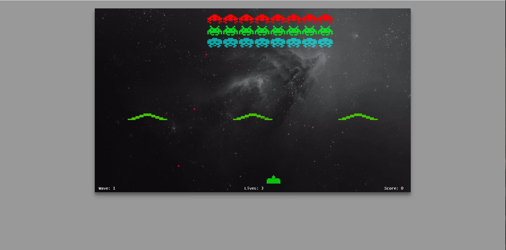
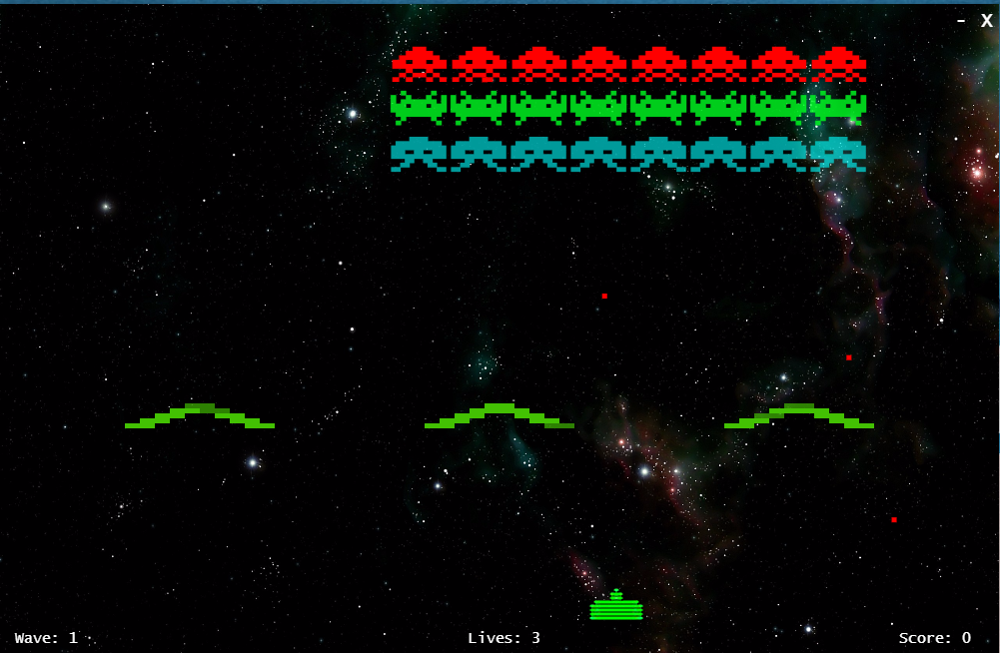

# Space invaders

https://ddivad195.github.io/SpaceInvadersJS/

A JavaScript remake of the popular classic 'Space Invaders'. Uses HTML5 canvas for rendering and runs as a desktop application using the Electron framework.

#Usage:
The project can be used in browser by running the `chrome.index.html` file. 

It can also run as an electron app. 

To run the game like this, these are the steps:
- Clone the Github Repo 
- `npm i` to install project dependencies
- `gulp start` to run the app
(Requires Node.js)

